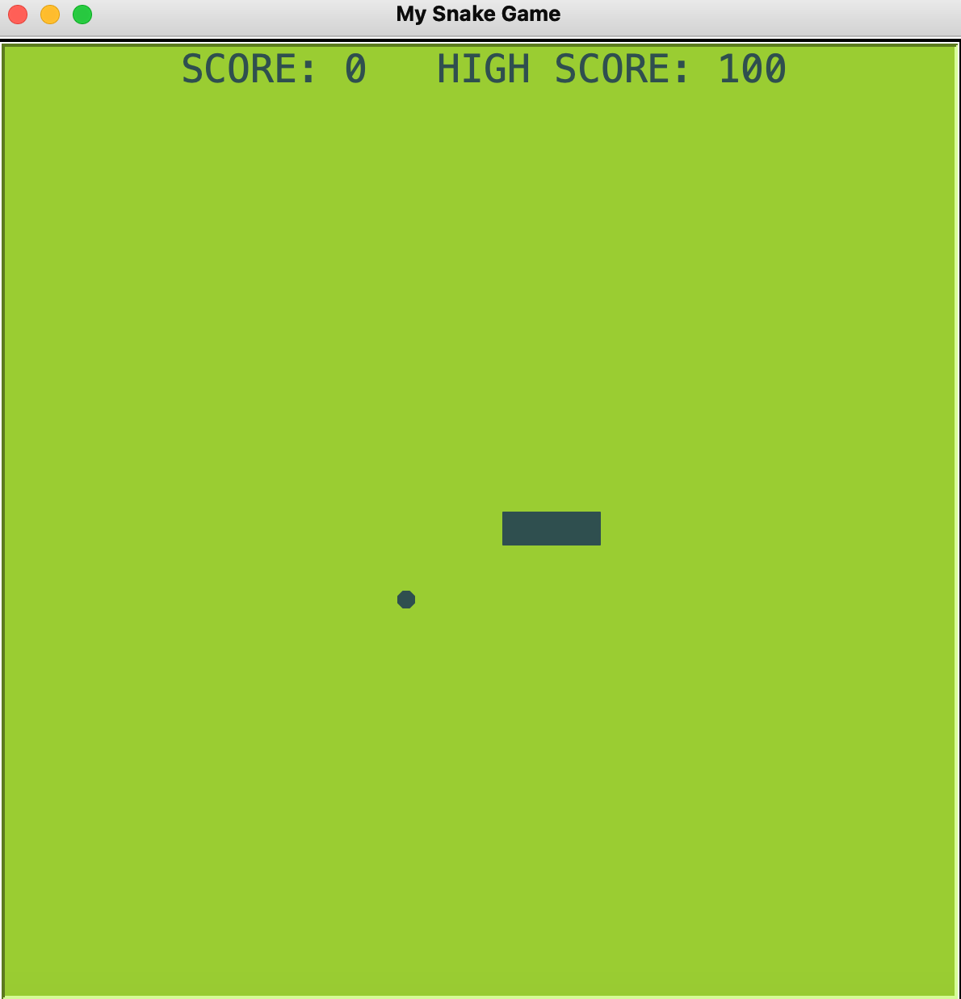

# Snake
Python implementation of the classic Snake game.

# Requirements

- Turtle

# File organization

- **data.txt**: contains the highest score recorded.
- **food.py**: define the food object.
- **main.py**: starting point of the project.
- **scoreboard.py**: define the scoreboard object.
- **snake.py**: define the snake object.

# How to run it
Execute the starting point of the project with:
    
    python3 main.py

# How to play it
As soon as the game is running, the snake will be moving. Control it using the arrow keys of your keyboard.

