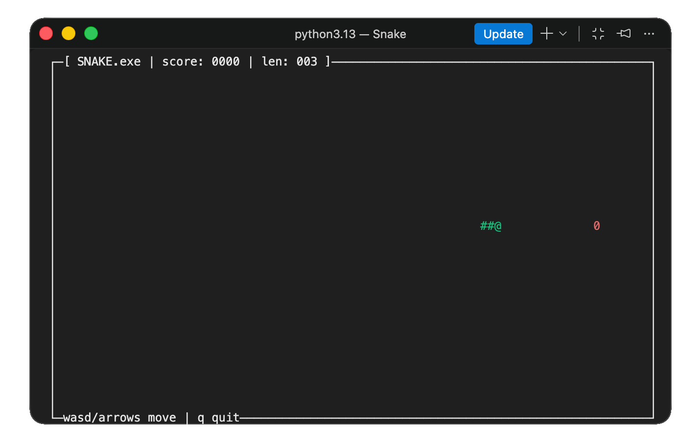

# Snake

Geek-style terminal Snake game, built with Python's `curses`. No dependencies.



## Requirements

- Python 3
- A terminal with `curses` support (built into Python on macOS/Linux; on
  Windows install `windows-curses` via `pip install windows-curses`)

## Run

```bash
python3 snake.py
```

## Install as a terminal command

Make it executable and link it into a directory on your `PATH` so you can
just type `snake`:

```bash
chmod +x snake.py
mkdir -p ~/.local/bin
ln -s "$(pwd)/snake.py" ~/.local/bin/snake
```

Make sure `~/.local/bin` is on your `PATH` (add to `~/.zshrc`/`~/.bashrc` if
not):

```bash
export PATH="$HOME/.local/bin:$PATH"
```

Then run from anywhere:

```bash
snake
```

## Controls

| Key            | Action    |
|----------------|-----------|
| `W`/`A`/`S`/`D` or arrow keys | Move |
| `Q` or `Esc`   | Quit      |

Speed increases as your score grows. Hitting a wall or yourself ends the game.

## License

MIT — see [LICENSE](LICENSE).
